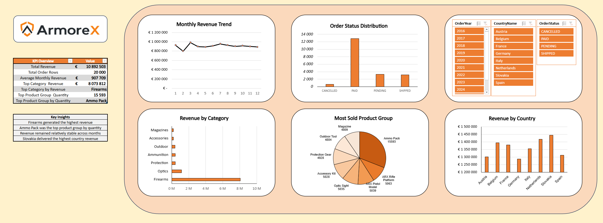

# ArmoreX Sales Dashboard in Excel

This project presents an interactive Excel dashboard created for a fictional company, ArmoreX.

## Project overview
The goal of this project was to analyze sales performance using Excel and create a clear business dashboard with KPI tracking, PivotTables, PivotCharts, and slicers.

## Tools used
- Excel
- PivotTables
- PivotCharts
- Slicers
- Data cleaning
- KPI reporting

## Dashboard features
- Total Revenue
- Total Order Rows
- Average Monthly Revenue
- Top Category Revenue
- Top Category by Revenue
- Top Product Group Quantity
- Top Product Group by Quantity
- Monthly Revenue Trend
- Revenue by Category
- Revenue by Country
- Order Status Distribution
- Interactive filters by year, country, and order status

## Key insights
- Firearms generated the highest revenue
- Ammo Pack was the top-selling product group by quantity
- Revenue remained relatively stable across months
- Slovakia delivered the highest country revenue

## Files included
- Excel dashboard file
- Dashboard screenshots
- Supporting project assets
